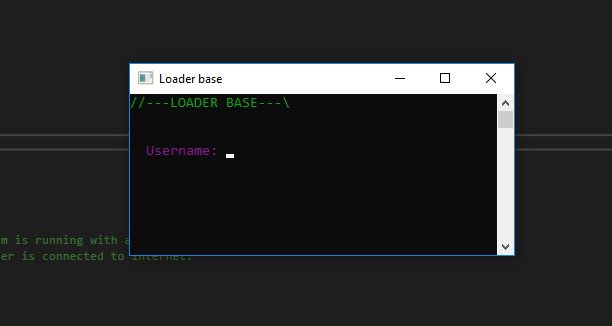
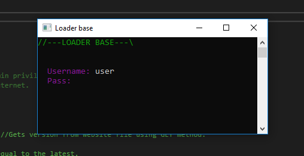
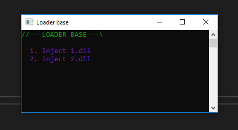

# Simple C++ DLL loader.

The whole code is commented to help beginners.

<h2>You'll find here: </h2>
-Program privileges check. 
-Internet connection check. 
-Program version check. 
-Login without mysqlconn. 
-szHwProfileGuid login system. 
-Download DLL from website. 
-Inject DLL using LoadLibrary

<h2>Screenshots:</h2>

